# The ZeroEffs

Duncan's `ZeroEffs` uses the base of the Voron V0, overhauled with several community mods, all rolled up together into a single package to see how it all works (and it worked well).  This also required a few customizations for my needs, which are also contained within this repository.

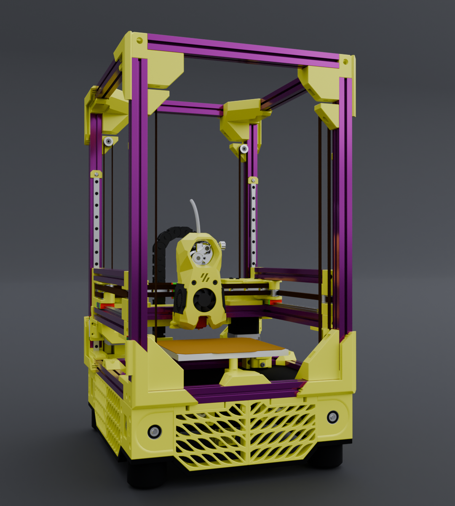 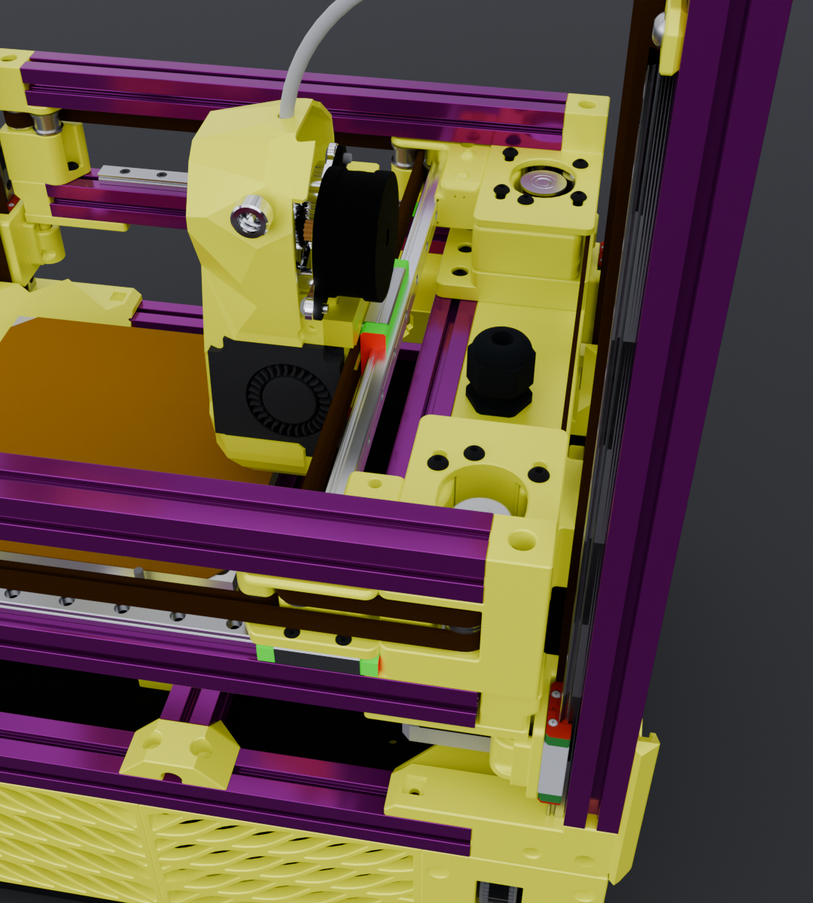

It has been 3 years to get to this point.  Sorry for the wait!

ZeroEffs is comprised of the following:

- [F-Zero QLG conversion by zruncho](https://github.com/zruncho3d/f-zero).
- [BoxZero topless conversion by zruncho](https://github.com/zruncho3d/BoxZero). Note that nothing was used from this repo.  I believe I only used it as a reference for the upper 100mm extrusion extension.  However, it validated this overall build so special thanks to zruncho!
- [ZeroPanels by zruncho](https://github.com/zruncho3d/ZeroPanels). I recall there being a special set just for the F-Zero; but, it may have been all merged now as I cannot find the reference.  ZeroPanels previously (years ago?) required a Fusion360 account to adjust the snap-portion past where F-Zero's corners budged out to.  So, there was a special set made just for the F-Zero but I can't find it.  Hopefully the latest v3 release handles F-Zero by default?  If not, you can use side-cutters to trip the strips.
- [ZeroClick by zruncho](https://github.com/zruncho3d/ZeroClick). For the MiniStealth toolhead, it comes with it's own toolhead mount (it's in the CAD too).  Everything else is ZeroClick with the Side mounted base (again, in the CAD).
- [Nudge by zruncho](https://github.com/zruncho3d/nudge). Using the "lower" base as you need to raise it to its highest position for the F-Zero 1515 bed cross member.  However, this does need to be mounted on the front side, which blocks the Zero-Filter.  (hence why I'm adapting an external Nevermore design, at some point)
- [Pandora (not Pandora Box) gantry by MasturMynd](https://github.com/MasturMynd/Pandora).
- [MiniStealth by Atrushing](https://www.teamfdm.com/files/file/616-mini-stealth-lgx-lite/).  The author was kind enough to make a VolcoMosq edition at my request, using the UHF extended ducts matched exactly.

Without the truly awesome work by these individuals, this machine would never have been conceived.  All I've done is to put it all together into a single file to check for clearances, since I was merging V0, F-Zero, and Saladfork mods into one.

You will find the assembly of the CAD in `/cad`.

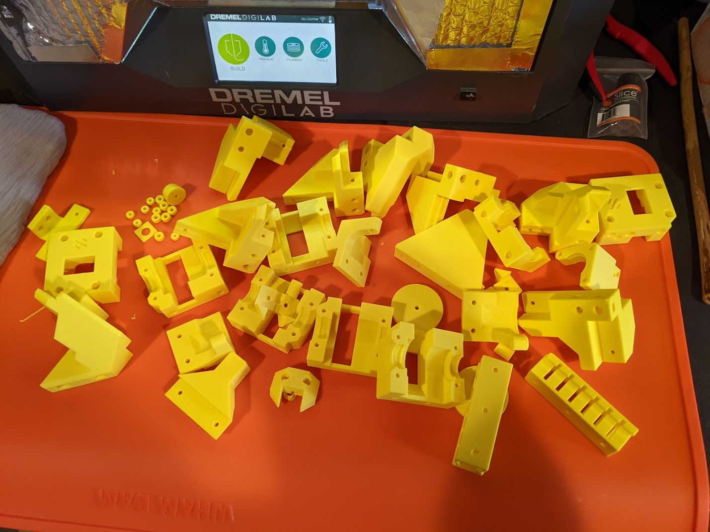
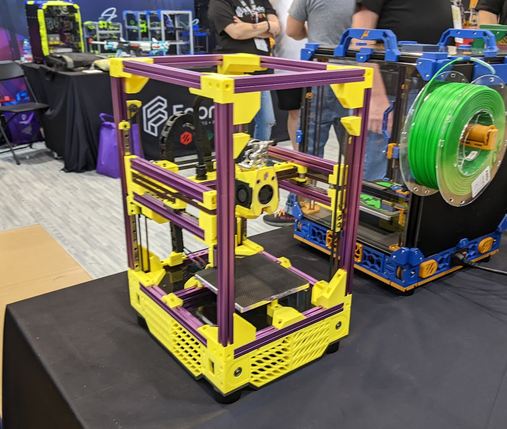

https://github.com/user-attachments/assets/d1783b58-280e-4cd8-9f2b-ace71146b2f8

## Duncan's Mods

There were two mods developed for this project.  They are purely optional and you do not have to use them.  You will find the CAD of the mods in `/cad` and aligned-for-strength meshes ready to FDM print in `/stl`.

### - **pandora_extrusionless_xy-mount**

This removes the 1515 extrusion on the X-gantry, giving you a "naked" mgn9 rail.  It uses a 200mm mgn9 rail, either C or H to match whatever carriage you use.  

This project was originally inspired by [Richardjm's floating MGN9-H idea](https://github.com/richardjm/voron-parts/tree/main/voron-0.1/Mgn9h).

My version fits the Pandora gantry only (I have no idea if it would fit in the PandoraBox's gantry).

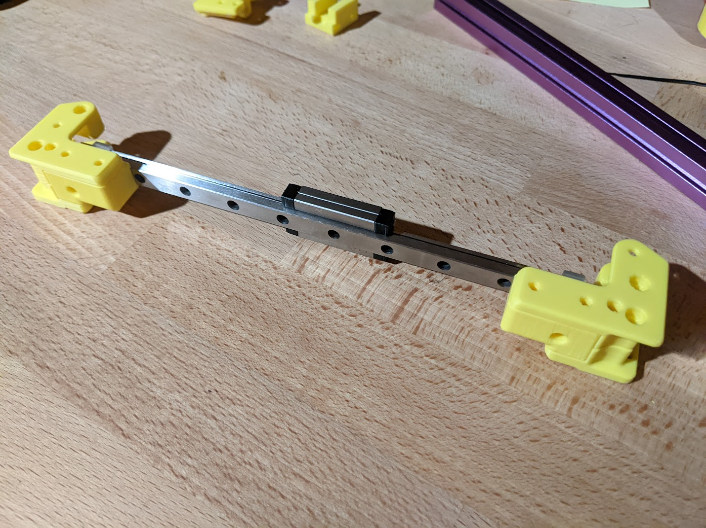

https://github.com/user-attachments/assets/bf14ea4c-bfce-4443-8aa9-824eb8d70aa2

### - **ministealth_x-carriage_mgn9h**

A highly specialized x-carriage for the Vz-HextrudORT extruder and MiniStealth only, made for an MGN9-H pattern, to fit my particular build.  It's specific as the strain relief interferes with any LGX Lite or similar mounting pattern extruders.

The carriage has a number of unique features that I've wanted for my build:

- Aligned CoM (center of gravity) in Y for VzHex and heavy VolcoMosq copper block.
- Moved the entire printhead "as far back in Y" as possible.
- Hide-away belt system to leave long for adjustments (see pics below).
- Hide-away wiring using internal channels.
- Additional reinforcements from "above", "below", and fan attachment points for the MiniStealth, VzHex extruder, and 4010s all into this single carriage.
- Mosquito-Net compatibility for the heavy VolcoMosq copper block (with a custom plate TBA).

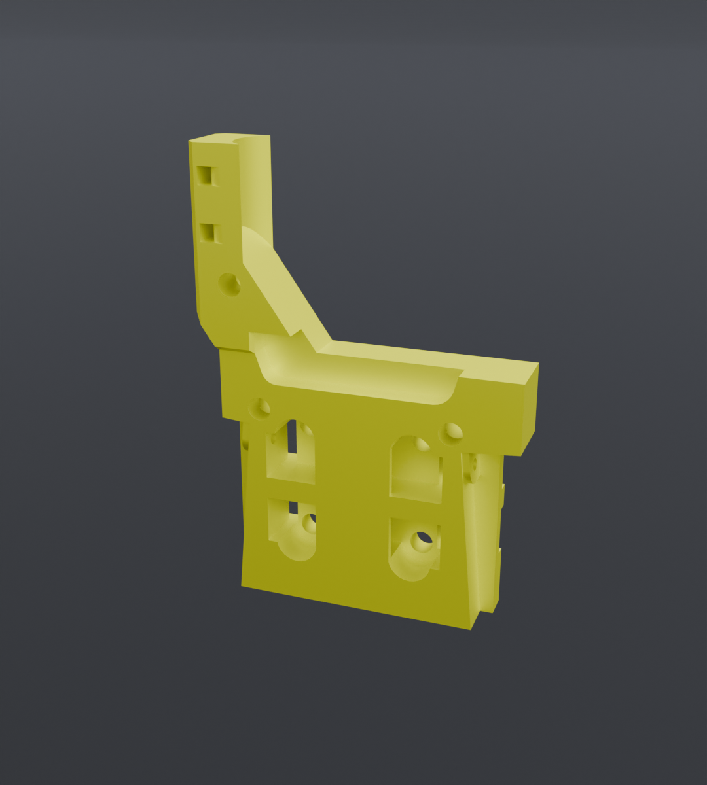
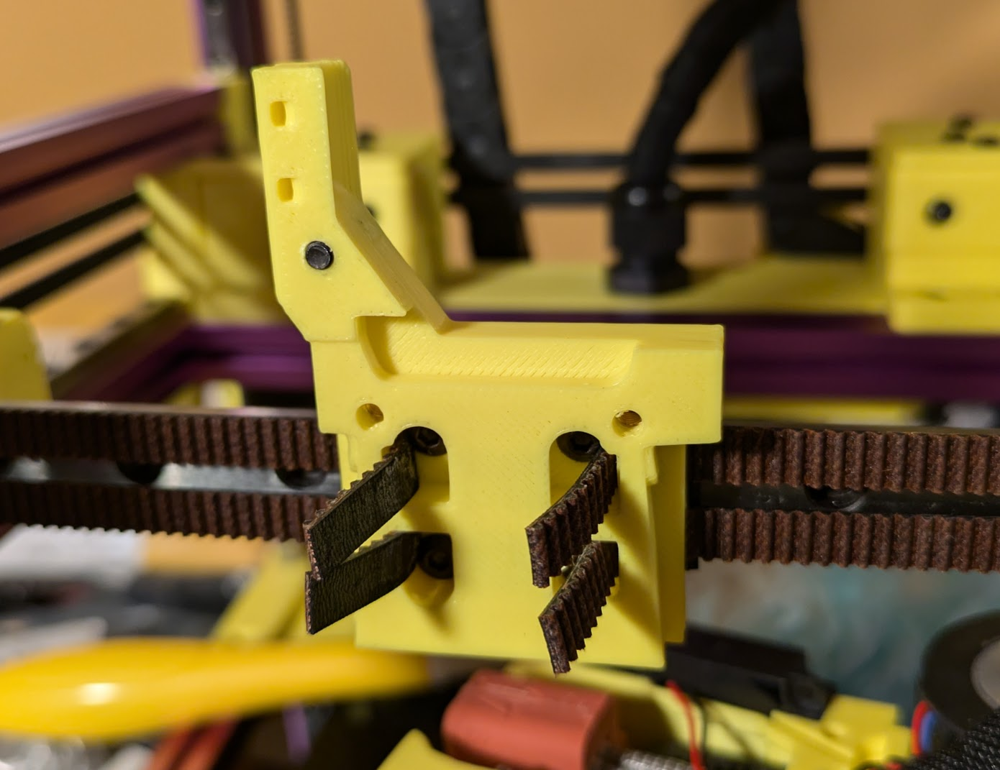
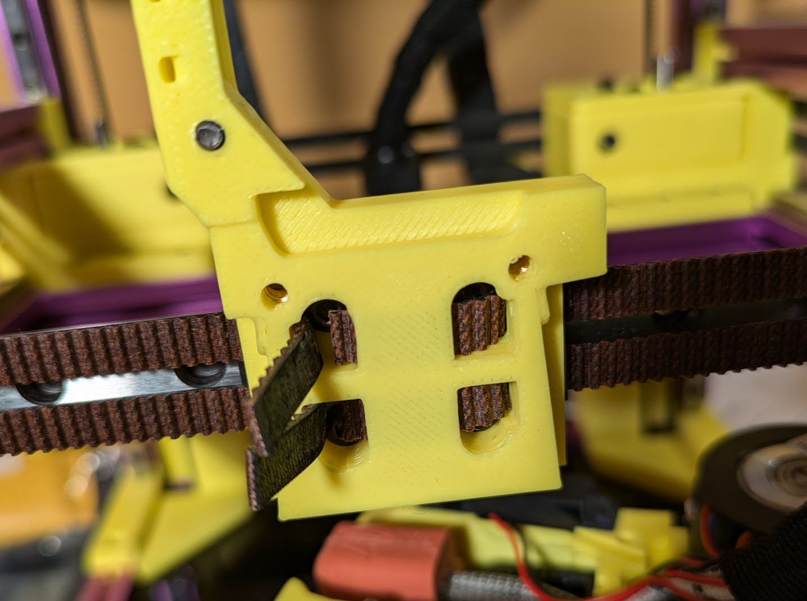

Note that with the ZeroClick, the position has been moved ever so slightly down.  If the ZeroClick side mount does not clear (toolhead too low), just add a washer or two under the side mount.

I apologize but I do not have plans to make a more compatible x-carriage: this one took me 2 years and far too many revisions and mod changes to finally "get something done."  

You are free to use any other "forward facing MGN9" x-carriage and toolhead.  However, you'll need to check the ZeroClick clearances or use something else.

### - Mini Stealth - Crop Top

The Mini Stealth rendered here and in the CAD is the stock one.  However, this is not the version I am running on my machine.  

This "Crop Top" was done in the slicer, even the Fabreeko "F".  The author has instructions on their release page: https://www.teamfdm.com/files/file/616-mini-stealth-lgx-lite/

For the Fabreeko "F", you'd use a normal "cube" resized to roughly fill the default Voron logo.  The last step is to add your SVG of choice, but as a "Subtractive" feature type (in PS you can right-click and change the Type of the object to subtractive).  

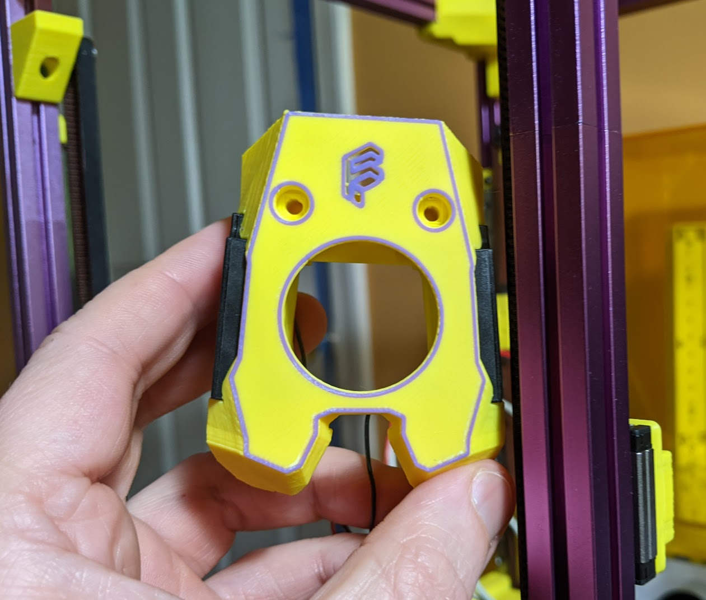 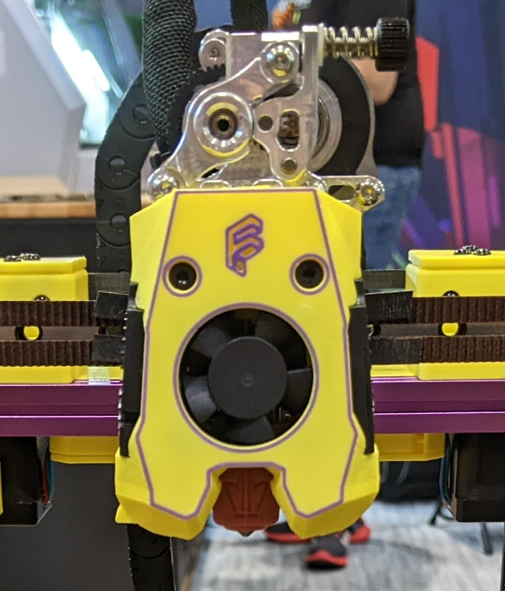

## No Toolboard ?!

No, there are no toolboard provisions.  I direct-wire back to the wiring box on the gantry, where all of my quick disconnects are hidden (the big yellow box in F-Zero between the AB motor mounts).  It makes for a super-clean look.  

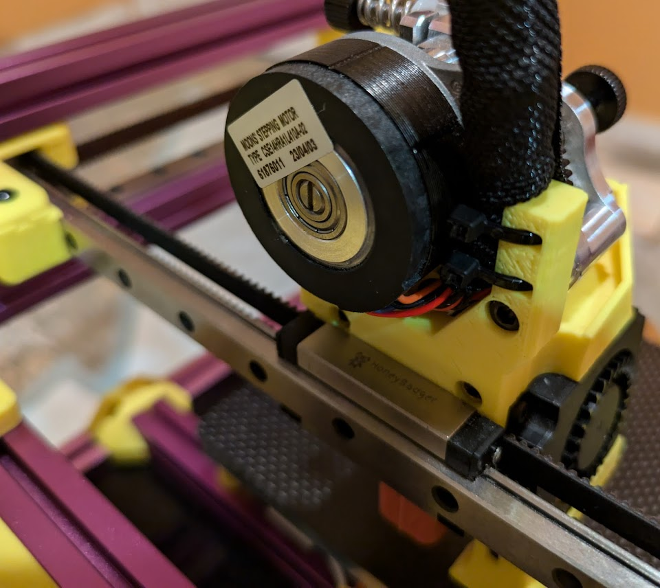

If any toolhead wires are too short, I add an inline JST in the very short umbilical. 

For input shaping, print or purchase a nozzle version of an ADXL.  I highly recommend watching Nero3D's video on using a RPi Pico + ADXL + I used RJ45 networking cable to make a portable input shaping, nozzle attachment device.

## STLs

The STLs for my two mods above have been exported with proper print orientations, ready to go.

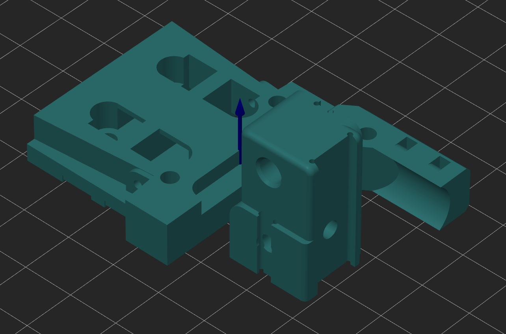

## TODO

There are still a few todo items on the agenda.  None of which prevents the machine from working.  However, they are good QoL improvements that should be done at some point.

- Panels-as-Structure mod to add panels directly screwed into the sides.  This is to eliminate the "rocking" forward and backwards of the tall BoxZero design and high QLG positions.  This is also why you do not see ZeroPanels on my pictured builds on display, even though it is in the CAD.
- Move the bed backwards in Y to account for full motion.  While you can get 120x120 just fine, the front of the ministealth hits the Z belts and doesn't let  you go any further out of 120 in X when moved to Y10 or less.  The solution will be to move the bed backwards in Y by stretching the front bed mount.
- Custom Nevermore HEPA+Carbon filter.  I'm thinking a mini-StealthMax.  The ZeroFilter, while excellent, does not have HEPA.  And it interferes with the Nudge position requirement (see CAD).
- Mosquito-Net solution in the MiniStealth.  My x-carriage already has provisions for it.  So it's just a matter of CADing up a solution for a laser cutter!
- PrintShift part ejection system.  The front lower printed corners have already been modified in my build to clear it.

And finally... An ZeroEffs "ToolChanger", mounted at the front-top with just two toolheads.  One to function all the time, and the other to allow me functionality to continue more mods (filament cutter, etc).  

These were always my plans and why I used 220mm Z rails from a Micron 180.  And now there's a StealthChanger V2.4 mod that actually did exactly part by part of my crazy idea.  Big shout out to that team, this is awesome: https://github.com/DraftShift/StealthChanger.  

I may slowly get to these over time.  Life comes first though.  Feel free to ping me on the Fabreeko Discord about them.

## Origin Story 

  
If you really want to know...

  
  

  "Zero Effs"

  This project originated during a difficult time in my life and stands as a testament to the odds.
  

